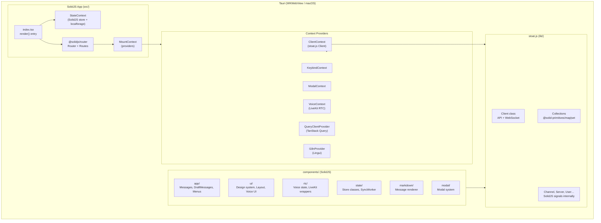
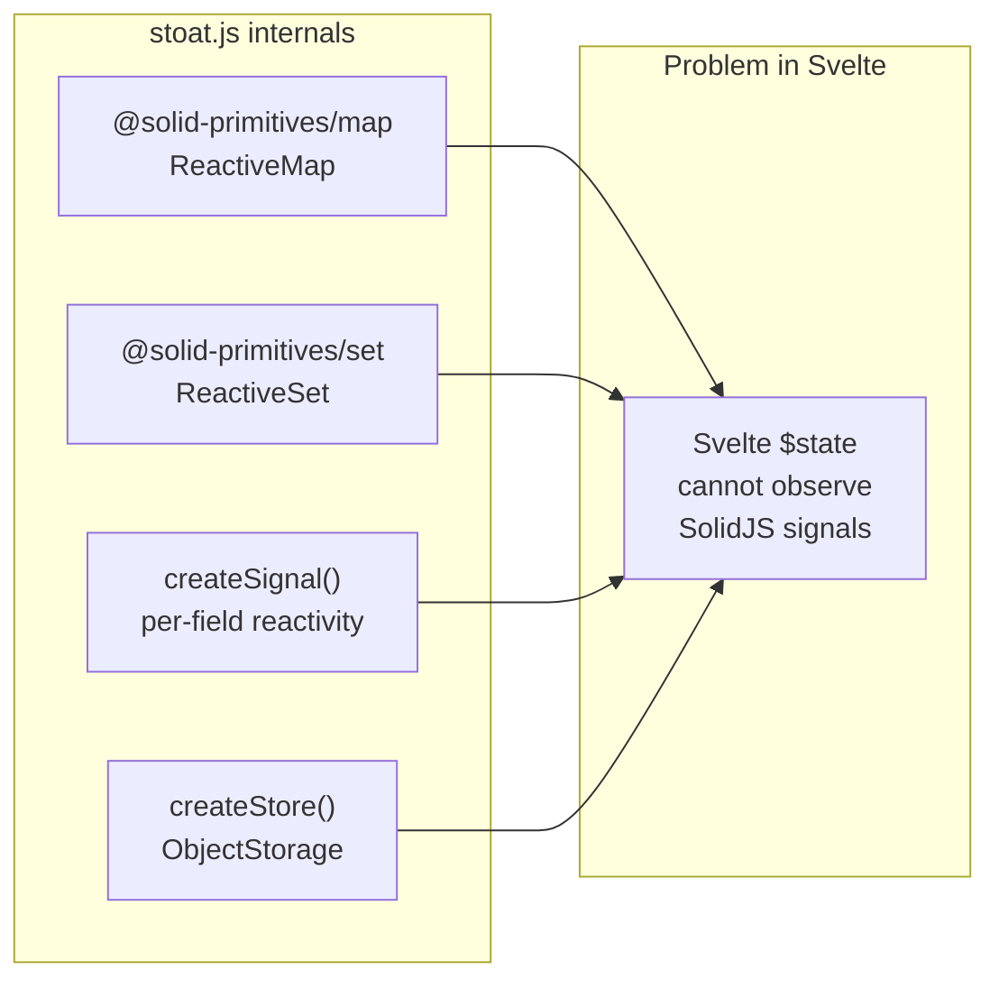
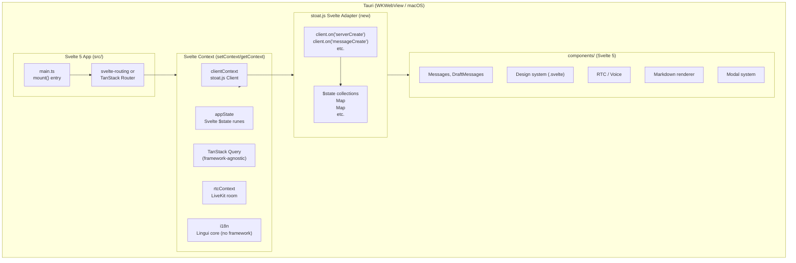
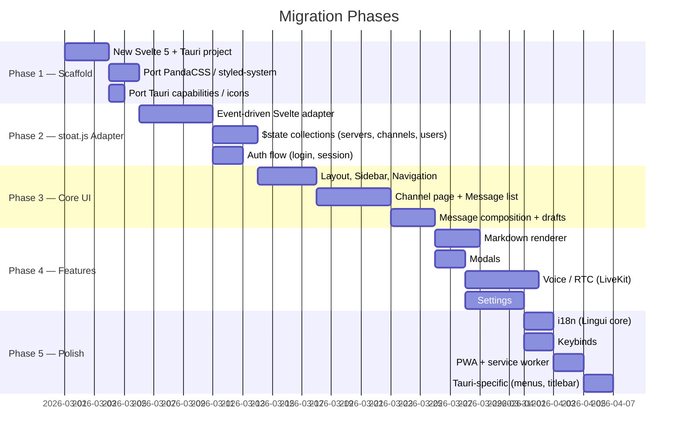
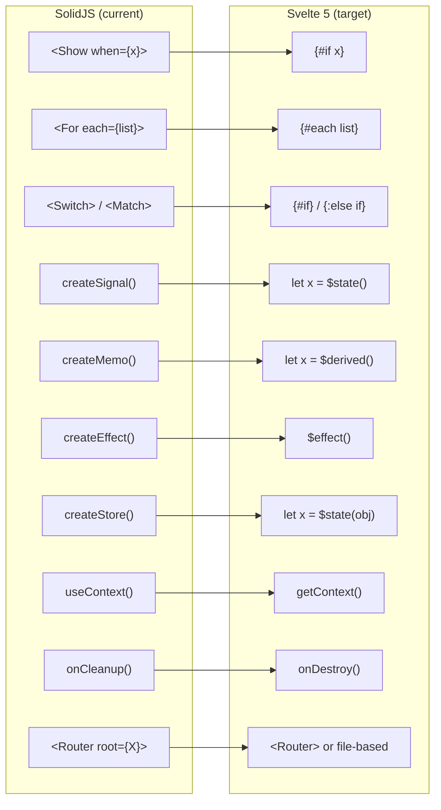
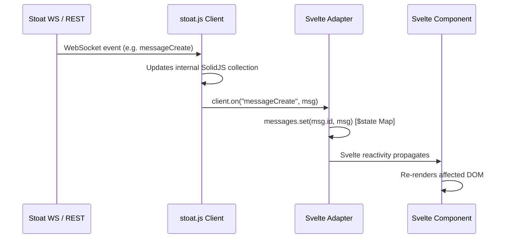

# SolidJS → Svelte 5 Migration Guide

> High-level architecture migration plan for the Stoat chat client.
> Current stack: SolidJS + `stoat.js` (SolidJS-reactive) + Tauri + PandaCSS.
> Target stack: Svelte 5 + `stoat.js` (event-driven adapter) + Tauri + PandaCSS.

---

## 1. Current Architecture

---

## 2. Core Problem: SolidJS-Coupled Reactivity in `stoat.js`

The fundamental blocker is that `stoat.js` uses SolidJS primitives internally for reactivity.
Svelte cannot observe changes in SolidJS signals directly.

**Solution:** Wrap `stoat.js` with an **event-driven Svelte adapter** that subscribes to `client.on(...)` events and writes into Svelte `$state` runes.

---

## 3. Target Architecture

---

## 4. Migration Phases

---

## 5. Component-by-Component Mapping

---

## 6. `stoat.js` Adapter Strategy

Rather than forking `stoat.js`, create a thin adapter that bridges its event emitter to Svelte `$state`:

Key adapter responsibilities:
- Subscribe to all `client.on(...)` events on init
- Maintain `$state` Maps for `servers`, `channels`, `users`, `members`, `messages`
- Expose typed `getContext()` accessors throughout the app
- Handle `unsubscribe` / cleanup in `onDestroy`

---

## 7. What Transfers Directly (No Rewrite)

| Asset | Status |
|---|---|
| `stoat.js` API client (HTTP + WS) | ✅ Keep as-is |
| Tauri `src-tauri/` (Rust, capabilities, icons) | ✅ Keep as-is |
| PandaCSS config + `styled-system/` output | ✅ Keep as-is |
| `lingui.config.ts` + translation catalogs | ✅ Keep, use Lingui core |
| `playwright.config.ts` + E2E tests | ✅ Keep |
| PWA manifest + service worker logic | ✅ Port (minimal changes) |
| LiveKit RTC logic (`components/rtc/`) | ⚠️ Port (swap SolidJS signals for `$state`) |
| Markdown renderer logic | ⚠️ Port (swap JSX for Svelte snippets) |
| All SolidJS `.tsx` components | ❌ Rewrite as `.svelte` |
| `@solid-primitives/*` collections | ❌ Replace with `$state` Maps |
| `@solidjs/router` | ❌ Replace with TanStack Router or svelte-routing |
| `vite-plugin-solid` | ❌ Replace with `@sveltejs/vite-plugin-svelte` |
