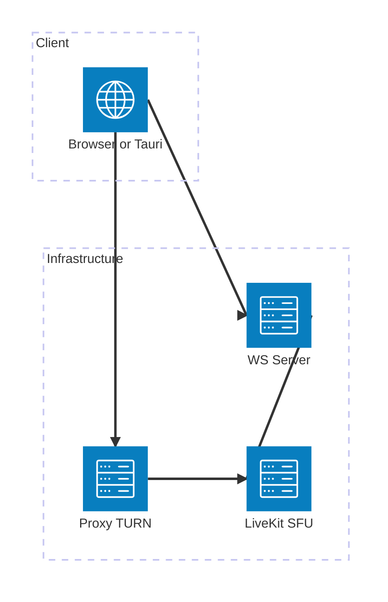
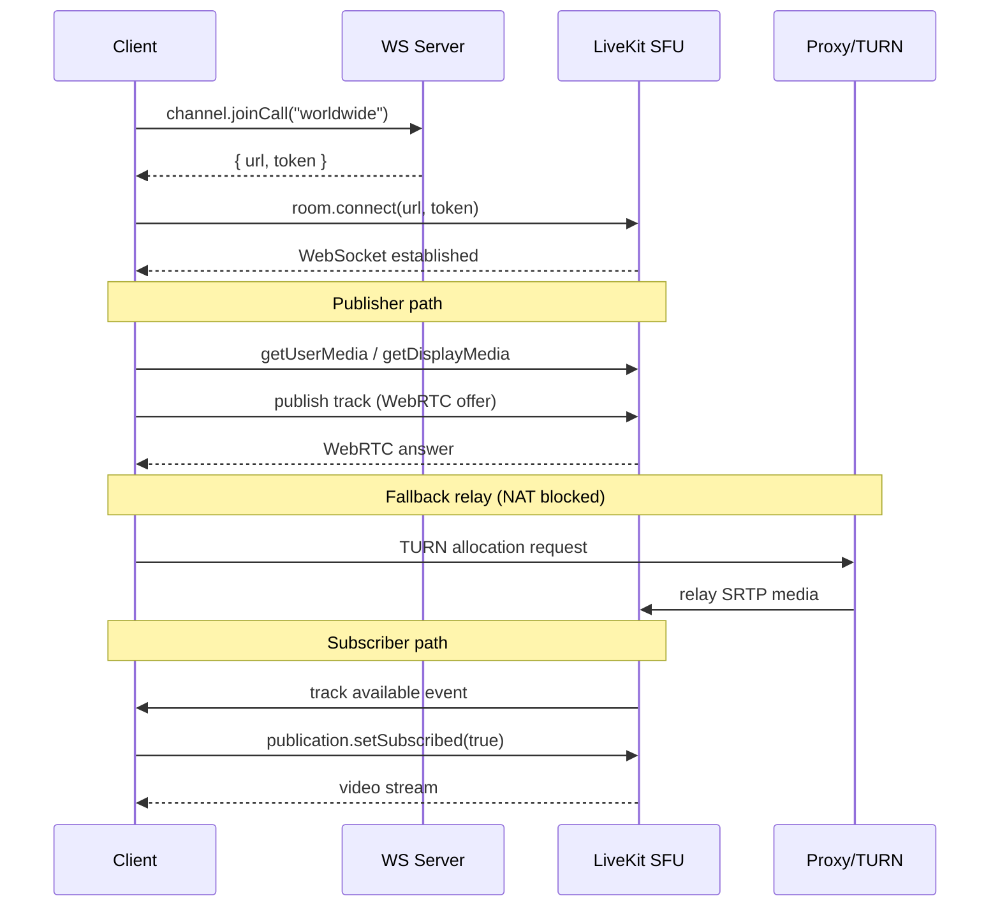

# Video Streaming Implementation Guide

> Covers both camera and screen-share flows.
> Assumes familiarity with the existing LiveKit-based voice infrastructure in `components/rtc/`.

---

## 1. Architecture Overview

### Static topology



### Connection & streaming flow



- **WS server** — the existing Revolt API WebSocket. `channel.joinCall("worldwide")` returns a LiveKit `url` and short-lived `token`.
- **Media server** — the LiveKit SFU. Receives tracks from the publisher, forwards them selectively to subscribers. Handles codec negotiation (VP8/VP9/H.264/AV1), simulcast, and bandwidth adaptation.
- **Proxy / TURN server** — relays UDP traffic when a direct peer–SFU path is blocked by NAT or firewalls.

> **Video piggybacks on the existing audio connection.**
> A LiveKit `Room` is a single WebRTC peer connection that multiplexes every track type — microphone, camera, and screen share — over the same transport and signalling channel. Calling `toggleCamera()` or `toggleScreenshare()` simply publishes an additional track to the already-connected room; no second handshake, token request, or separate connection is needed.

---

## 2. Backwards Compatibility

Adding video is **fully backwards compatible**. Older clients that don't implement video will not be broken or affected in any way.

The reason is LiveKit's **selective subscription** model (covered in detail in §4 (Track Subscription Model)). When a publisher adds a camera or screen-share track, the SFU broadcasts a metadata event to every participant in the room — but no video data is transmitted to a subscriber until that subscriber explicitly opts in via `publication.setSubscribed(true)`. An older client that has no video handling code will:

1. Receive the `trackPublished` event and ignore it (or never listen for it at all).
2. Never call `setSubscribed(true)` on the new track.
3. Receive zero video bytes — the SFU simply won't forward the stream.

Audio tracks are a separate subscription entirely and are completely unaffected. The room connection, token, and server-side infrastructure require no changes.

---

## 3. What Is Already in Place

| Feature | Location | Status |
|---------|----------|--------|
| LiveKit `Room` construction & connect | `components/rtc/state.tsx` — `Voice.connect()` | ✅ done |
| `video` and `screenshare` state signals | `Voice` class | ✅ done |
| `toggleCamera()` | `Voice.toggleCamera()` | ✅ done |
| `toggleScreenshare()` | `Voice.toggleScreenshare()` | ✅ done |
| Track discovery (`useTracks`) | `Demo.tsx` — `RoomParticipants` | ✅ done (demo only) |
| `VideoTrack` renderer | `Demo.tsx` | ✅ done (demo only) |
| Audio playback | `RoomAudioManager.tsx` | ✅ done |
| Subscription management | `RoomAudioManager.tsx` (audio only) | ⚠️ needs video |

The core SDK hooks are wired. What's missing is **production subscription management for video tracks** and a **polished video grid UI**.

---

## 4. Track Subscription Model

LiveKit uses **selective subscription**: the server publishes tracks, but each subscriber must explicitly opt-in per track. This saves bandwidth.

```
Publisher (local participant)
  └─ publishes Camera track          TCameraPublication
  └─ publishes ScreenShare track     TScreenSharePublication

Subscriber (remote participant)
  └─ sees RemoteTrackPublication (subscribed = false by default)
  └─ must call publication.setSubscribed(true) to pull the stream
```

### When to subscribe

Subscribe to a video track when the track's tile is **visible on screen** and unsubscribe when scrolled away or the tile is collapsed. This mirrors what `RoomAudioManager` already does for audio, but with a visibility-based gate.

---

## 5. Implementation Steps

### 5.1 Video Subscription Manager

Create `components/rtc/components/RoomVideoManager.tsx` alongside `RoomAudioManager`.

```tsx
import { createEffect } from "solid-js";
import { useTracks } from "solid-livekit-components";
import { Track, RemoteTrackPublication } from "livekit-client";
import { isLocal } from "@livekit/components-core";

/**
 * Automatically subscribes to all visible video tracks.
 * A future IntersectionObserver-aware version can pass a set of
 * visible participant IDs from the grid component.
 */
export function RoomVideoManager(props: { visibleIds?: Set<string> }) {
  const tracks = useTracks(
    [
      { source: Track.Source.Camera,      withPlaceholder: false },
      { source: Track.Source.ScreenShare, withPlaceholder: false },
    ],
    { onlySubscribed: false, updateOnlyOn: [] },
  );

  createEffect(() => {
    for (const track of tracks()) {
      if (isLocal(track.participant)) continue;
      if (track.publication.kind !== Track.Kind.Video) continue;

      const pub = track.publication as RemoteTrackPublication;
      const shouldSubscribe =
        !props.visibleIds || props.visibleIds.has(track.participant.identity);

      if (pub.isSubscribed !== shouldSubscribe) {
        pub.setSubscribed(shouldSubscribe);
      }
    }
  });

  return null; // data-only component
}
```

Mount it next to `RoomAudioManager` inside `VoiceContext`:

```tsx
// components/rtc/state.tsx — inside VoiceContext JSX
<InRoom>
  <RoomAudioManager />
  <RoomVideoManager />   {/* add this */}
</InRoom>
```

---

### 5.2 Video Grid Component

The grid must handle two track sources and different aspect ratios.

```tsx
// components/rtc/components/VideoGrid.tsx
import { For } from "solid-js";
import { TrackLoop, VideoTrack, useTracks } from "solid-livekit-components";
import { Track } from "livekit-client";

export function VideoGrid() {
  const tracks = useTracks(
    [
      { source: Track.Source.Camera,      withPlaceholder: true  },
      { source: Track.Source.ScreenShare, withPlaceholder: false },
    ],
    { onlySubscribed: false },
  );

  return (
    <div class={gridStyle}>
      <TrackLoop tracks={tracks}>
        {() => <VideoTile />}
      </TrackLoop>
    </div>
  );
}

function VideoTile() {
  // useTrackRefContext() gives the current track from TrackLoop
  return (
    <div class={tileStyle}>
      <VideoTrack />
      <ParticipantLabel />   {/* reuse from Demo.tsx */}
    </div>
  );
}
```

**Layout algorithm**: use CSS `grid` with `auto-fill` and a `minmax` that adapts to participant count. Screen-share tiles can be flagged as `grid-column: span 2` to give them more space.

```tsx
// Tile style — applied inside VideoTile (5.2)
const isScreenShare =
  useTrackRefContext().source === Track.Source.ScreenShare;

<div
  class={css({
    gridColumn: isScreenShare ? "span 2" : "span 1",
    aspectRatio: isScreenShare ? "16/9" : "4/3",
    position: "relative",
    borderRadius: "token(radii.md)",
    overflow: "hidden",
    background: "black",
  })}
>
```

---

### 5.3 Camera Toggle UI

The `Voice.toggleCamera()` method already exists. Wire it to a button:

```tsx
const voice = useVoice();

<IconButton
  aria-label="Toggle camera"
  pressed={voice.video()}
  onClick={() => voice.toggleCamera()}
>
  {voice.video() ? <MdVideocam /> : <MdVideocamOff />}
</IconButton>
```

On **Tauri desktop**, `getUserMedia` works through the WebView's media access. On macOS/Windows the user will be prompted for camera permission at the OS level on first use — no additional handling is needed.

---

### 5.4 Screen Share Toggle UI

Screen share requires `getDisplayMedia`, which must be **user-gesture-initiated** (no autostart).

```tsx
<IconButton
  aria-label="Share screen"
  pressed={voice.screenshare()}
  onClick={() => voice.toggleScreenshare()}
>
  {voice.screenshare() ? <MdStopScreenShare /> : <MdScreenShare />}
</IconButton>
```

`LocalParticipant.setScreenShareEnabled(true)` calls `getDisplayMedia` internally via the LiveKit SDK. The SDK exposes a `screenShareCaptureDefaults` option in the `Room` constructor if you need to pass `preferCurrentTab`, `selfBrowserSurface`, or `systemAudio` constraints:

```ts
// state.tsx — Room constructor
const room = new Room({
  audioCaptureDefaults: { ... },
  audioOutput:          { ... },
  // add:
  screenShareCaptureDefaults: {
    audio: true,           // capture tab/system audio alongside video
    selfBrowserSurface: "exclude",
  },
});
```

On **Tauri desktop** `getDisplayMedia` requires the `media` capability to be listed in `src-tauri/capabilities/`. Check `tauri.conf.json` if screen share fails silently on desktop.

---

### 5.5 Simulcast & Bandwidth

For calls with more than ~4 participants, enable simulcast on the camera track so the SFU can downscale for subscribers on poor connections:

```ts
// state.tsx — after room.connect(...)
await room.localParticipant.enableCameraAndMicrophone();
// OR when toggling:
await room.localParticipant.setCameraEnabled(true, {
  resolution: VideoPresets.h720.resolution,
});
```

Configure the SFU-side simulcast layers in the LiveKit server config (outside the client). The client opts in by publishing with `simulcast: true` (the LiveKit SDK default for camera tracks).

Screen-share tracks should **not** use simulcast — they need full resolution. The SDK disables simulcast for screen share by default.

---

## 6. Permissions Gating

Only offer camera/screen-share controls to participants who have the relevant channel permission. The existing `Voice.speakingPermission` check covers microphone; extend it:

```ts
// Voice class — add getters
get videoPermission() {
  return !!this.channel()?.havePermission("Video");
}

get screensharePermission() {
  return !!this.channel()?.havePermission("Screenshare");
}
```

Conditionally render the toggle buttons:

```tsx
<Show when={voice.videoPermission()}>
  <CameraToggle />
</Show>
<Show when={voice.screensharePermission()}>
  <ScreenShareToggle />
</Show>
```

---

## 7. Error Handling

| Failure | Cause | Mitigation |
|---------|-------|------------|
| `NotAllowedError` | OS/browser blocked camera | catch in `toggleCamera()`, surface a toast |
| `NotFoundError` | No camera device | catch, show "no camera found" message |
| `NotAllowedError` on screen share | User cancelled picker or Tauri capability missing | catch, silently reset `screenshare` signal |
| Track publish fails | Insufficient bandwidth / SFU error | listen to `Room.on("trackPublishFailed")` |

```ts
async toggleCamera() {
  const room = this.room();
  if (!room) throw "invalid state";
  try {
    await room.localParticipant.setCameraEnabled(
      !room.localParticipant.isCameraEnabled,
    );
    this.#setVideo(room.localParticipant.isCameraEnabled);
  } catch (err) {
    console.error("[rtc] camera toggle failed", err);
    // dispatch a UI notification here
  }
}
```

---

## 8. Tauri-Specific Notes

- Camera access works out of the box via the WebView (Chromium on Linux/Windows, WebKit on macOS).
- Screen share on **macOS** requires the `Screen Recording` privacy permission. Tauri does not request this automatically; the user must grant it in System Preferences. Consider showing a one-time onboarding dialog before calling `setScreenShareEnabled`.
- On Windows, `getDisplayMedia` with `audio: true` captures the system loopback but the user must have WASAPI loopback enabled. The LiveKit SDK handles codec negotiation transparently.

---

## 8. File Checklist

```
components/rtc/
  components/
    InRoom.tsx                    ✅ existing
    RoomAudioManager.tsx          ✅ existing
    RoomVideoManager.tsx          🔲 create (§4.1)
    VideoGrid.tsx                 🔲 create (§4.2)
  index.ts                       🔲 export new components
  state.tsx                      🔲 mount RoomVideoManager, add permission getters, improve error handling
```
